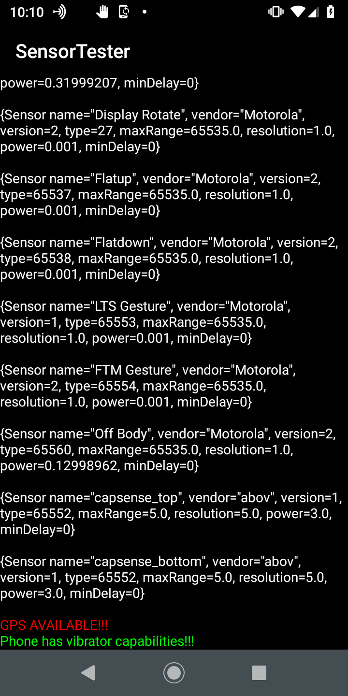

This is an android project done in android studios. Import The Zip , Build and Enjoy!!!
 
This simple android app was developed by me because it gives you an idea of what sensors your phone has available. Many times your looking thru settings to see what features you have. Sensors are one of those things most people including me where never sure just what sensors where in a given phone. This app displays a list of all sensors and features of them. Tells you if you got GPS abilities on your phone as well as if you got a Vibrator sensor/motor :)
 
Use anyway you want but you will have to build it first using android studios its not currently hosted on google play store yet.
 
Sample screen shot of app  
  
 
  
  
 Now you will never be confused on what sensors you have on your phone!
